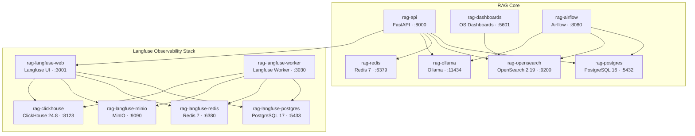
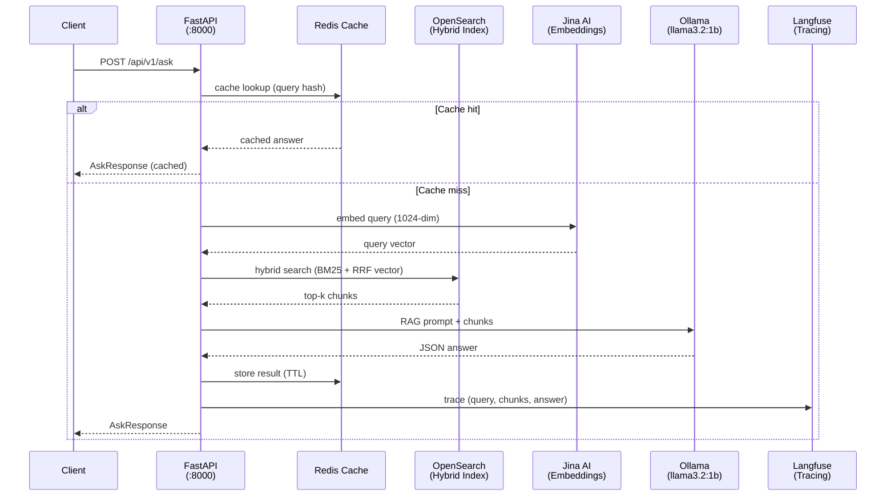
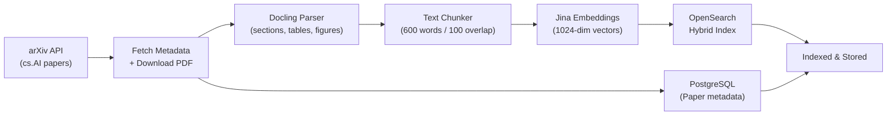
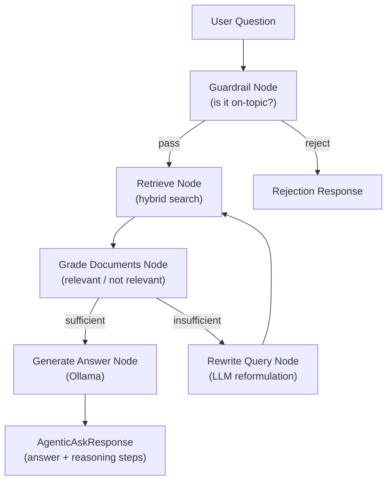
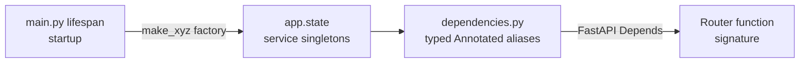

# System Architecture

Production-grade agentic RAG system for arXiv paper curation. Built across 7 weeks.

---

## 1. Docker Compose Stack (15 Containers)



All containers share a single `rag-network` bridge. Internal hostnames differ from localhost — e.g., `opensearch:9200` inside Docker vs `localhost:9200` on the host.

---

## 2. Query → Answer Data Flow



**Endpoints:** `/ask` (sync JSON), `/stream` (Server-Sent Events token stream), `/agentic-ask` (LangGraph agent, Week 7).

---

## 3. Ingestion Pipeline (Airflow DAG, daily 6 AM UTC)



Airflow DAG: `airflow/dags/arxiv_ingestion/`. Heavy `src.services.*` imports are deferred inside task functions (never at module level) to avoid DAG parse timeouts.

---

## 4. Agentic RAG Flow (LangGraph, Week 7)



Endpoint: `POST /api/v1/ask-agentic`. Feedback endpoint: `POST /api/v1/feedback` (scores a Langfuse trace).

---

## 5. src/ Code Structure

```
src/
├── main.py              # FastAPI lifespan — initialises all services into app.state
├── config.py            # Nested Pydantic settings (env var: REDIS__HOST → settings.redis.host)
├── dependencies.py      # Typed Annotated aliases for FastAPI Depends() injection
├── exceptions.py        # Full exception hierarchy (repository, parsing, LLM, pipeline)
├── database.py          # Module-level singleton for Airflow / non-FastAPI DB access
│
├── routers/
│   ├── ping.py          # GET  /api/v1/health
│   ├── hybrid_search.py # POST /api/v1/hybrid-search/
│   ├── ask.py           # POST /api/v1/ask  |  POST /api/v1/stream (SSE)
│   └── agentic_ask.py   # POST /api/v1/ask-agentic  |  POST /api/v1/feedback
│
├── services/
│   ├── opensearch/      # client.py, query_builder.py, index_config_hybrid.py  [Week 3]
│   ├── embeddings/      # Jina AI client (1024-dim)                             [Week 4]
│   ├── indexing/        # Text chunker + hybrid indexer                         [Week 4]
│   ├── ollama/          # LangChain-Ollama async wrapper + prompt builder       [Week 5]
│   ├── cache/           # Redis TTL cache, graceful fallback to None            [Week 6]
│   ├── langfuse/        # LangfuseTracer — v3 CallbackHandler + legacy spans   [Week 6]
│   ├── arxiv/           # arXiv API client with rate limiting                   [Week 2]
│   ├── pdf_parser/      # Docling-based structured extraction                   [Week 2]
│   ├── telegram/        # Bot integration (/ask, /search, /papers)              [Week 7]
│   ├── agents/          # LangGraph graph: 6 nodes + AgentState                 [Week 7]
│   └── metadata_fetcher.py  # Ingestion orchestrator (fetch → parse → index)   [Week 2]
│
├── models/paper.py      # SQLAlchemy ORM: single Paper table (UUID PK)
├── repositories/paper.py # All SQL queries: upsert, get_by_arxiv_id, list, stats
├── schemas/             # Pydantic DTOs: api/, arxiv/, embeddings/, indexing/
└── db/                  # BaseDatabase ABC + PostgreSQLDatabase + factory
```

---

## 6. Dependency Injection Pattern



Services created once in lifespan, stored in `app.state`, injected via typed aliases (`OpenSearchDep`, `OllamaDep`, `CacheDep`, etc.). `AgenticRAGService` is the exception — constructed per-request from already-injected singletons.

---

## 7. OpenSearch Index Design

One index (`arxiv-papers-chunks`) handles all search modes:

| Mode | Mechanism | When used |
|------|-----------|-----------|
| BM25 | OpenSearch full-text `match` | No Jina key / keyword queries |
| Vector | kNN with 1024-dim Jina vectors | Semantic similarity |
| Hybrid | BM25 + Vector via RRF pipeline | Default (`use_hybrid=true`) |

RRF (Reciprocal Rank Fusion) merges the two ranked lists at query time. No data duplication — single index for all modes.

---

## 8. Service UIs

| Service | URL | Credentials |
|---------|-----|-------------|
| FastAPI docs | http://localhost:8000/docs | — |
| OpenSearch Dashboards | http://localhost:5601 | — |
| Airflow | http://localhost:8080 | airflow / airflow |
| Langfuse | http://localhost:3001 | admin@example.com / admin123 |
| Ollama | http://localhost:11434 | — |
| MinIO (Langfuse storage) | http://localhost:9091 | langfuse_minio / langfuse_minio_secret |
